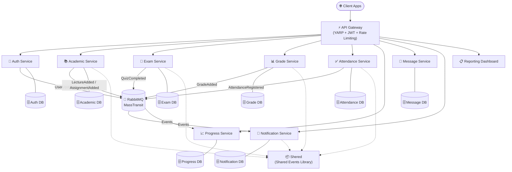

<div align="center">

# 🎓 University Management System — Microservices

<p align="center">
  
  
  
  
  
  
  
  
  
</p>

<p align="center">
  A production-grade <strong>distributed university platform</strong> built on clean microservices architecture.<br/>
  11 independent services, a YARP API Gateway, event-driven messaging via RabbitMQ/MassTransit,<br/>
  a shared contract library, and a full integration + unit test suite.
</p>

</div>

---

## 📑 Table of Contents

- [Architecture Overview](#-architecture-overview)
- [Services](#-services)
- [Shared Library — Shered](#-shared-library--shered)
- [Tech Stack](#-tech-stack)
- [Testing Suite](#-testing-suite)
- [Getting Started](#-getting-started)
- [Project Structure](#-project-structure)
- [Author](#-author)

---

## 🏗️ Architecture Overview



> Each service owns its own dedicated SQL Server database — no shared database, fully independent deployments.

---

## 🧩 Services

### ⚡ API Gateway
> **YARP Reverse Proxy** — single entry point for all client traffic

- Routes all incoming requests to downstream microservices via YARP configuration
- Enforces **JWT authentication** at the gateway level — no unauthenticated traffic reaches services
- **Rate limiting** (token bucket) to protect against abuse
- **Correlation ID middleware** for distributed tracing across all services
- **Serilog** structured logging with rolling log files

---

### 🔐 Auth Service
> **Identity & Access Management** — roles: Admin, Doctor, Student, Parent

- Full **ASP.NET Core Identity** with EF Core backend
- Multi-role registration and login flows for Admin, Doctor, Student, Parent
- **JWT token issuance** (access + refresh)
- **MassTransit** event publishing — fires `UserUpdatedEvent` on profile changes
- **Serilog** structured logging with correlation ID enrichment
- **Data seeding** for initial admin and role setup

**Features:** `Admin Auth` · `Doctor Auth` · `Student Auth` · `Parent Auth` · `Internal Endpoints` · `Extensions`

---

### 📚 Academic Service
> **Courses, Lectures, Assignments, Materials, Schedules, Departments**

- Manages the full academic lifecycle: departments, courses, course catalog, lectures, assignments, and lecture materials
- **File uploads up to 500 MB** (lecture materials via Kestrel + FormOptions configuration)
- **MassTransit** publishes `ILectureAdded`, `IAssignmentAdded` events consumed by Notification/Progress services
- **Doctor-specific** endpoints for content management
- **CQRS** with MediatR, **FluentValidation** on all commands/queries
- **Unit of Work + Repository Pattern** over EF Core + SQL Server

**Features:** `Assignments` · `CourseCatalogs` · `Courses` · `Departments` · `Doctor` · `Internal` · `LectureMaterials` · `Lectures` · `Schedule`

---

### 📝 Exam Service
> **Quizzes & Assessments**

- Create, manage, and submit quizzes (CQRS / MediatR vertical slice)
- **MassTransit** publishes `IQuizCompleted` events on submission
- JWT-guarded endpoints; all operations validated with **FluentValidation**
- Shares domain contracts via the **Shered** library
- **Serilog** logging + EF Core + SQL Server

**Features:** `Quiz` · `Internal`

---

### 📊 Grade Service
> **Grade Recording & GPA Tracking**

- Records and queries student grades per course/exam
- **MassTransit** publishes `IGradeAdded` events (consumed by Progress/Notification)
- Consumes external events via dedicated **Consumers** folder
- JWT-protected; FluentValidation + MediatR
- EF Core + SQL Server with Repository/Unit of Work

**Features:** `Grades` · `Internal`

---

### ✅ Attendance Service
> **Session Attendance Tracking**

- Registers and queries student attendance records
- **MassTransit** publishes `IAttendanceRegistered` events
- Internal endpoints for inter-service communication
- JWT-guarded with custom middleware, FluentValidation, MediatR
- EF Core + SQL Server + Repository Pattern

**Features:** `Attendance` · `Internal`

---

### 📈 Progress Service
> **Student Learning Progress Aggregator**

- Tracks and aggregates student learning progress (assignments, quizzes, attendance)
- Consumes async events from RabbitMQ to update progress records
- **HttpContextAccessor** for internal header-based service validation
- JWT + FluentValidation + MediatR + Unit of Work
- EF Core + SQL Server

**Features:** `Progress`

---

### 💬 Message Service
> **Real-Time Messaging + AI Assistant (Rashed)**

- Peer-to-peer messaging with conversation threading
- **AI-powered chat assistant** ("Ask Rashed") — AI message history, clear history, delete history
- Supports image/file attachments (`IFileHelper`, `IImageHelper`)
- Conversation and message management via CQRS vertical slices
- JWT-protected; MediatR + FluentValidation + EF Core + SQL Server

**Features:** `Messages` · `Conversations` · `AI (AskRashed / GetAiHistory / ClearAiHistory / DeleteHistory)`

---

### 🔔 Notification Service
> **Event-Driven Push Notifications**

- Consumes async domain events from RabbitMQ (new lectures, grades, assignments, quiz completions, attendance)
- Delivers in-app notifications to the relevant users
- **MassTransit** consumer + EF Core + SQL Server
- JWT-protected with custom middleware; Serilog logging

**Features:** `Notifications`

---

### 📋 Reporting Dashboard Service
> **Aggregation Reporting — No Direct Database**

- Pure **HTTP aggregation** service — no own database, queries downstream services via HTTP
- Role-based dashboard views: Admin, Doctor, Student, Parent
- **Serilog** rolling log files with 7-day retention
- FluentValidation + MediatR + JWT
- Acts as a BFF (Backend for Frontend) for reporting needs

**Features:** `Admin Reports` · `Doctor Reports` · `Student Reports` · `Parent Reports`

---

### 📧 Email Service
> **Transactional Email Delivery**

- Sends transactional emails (registration confirmations, notifications) via **MimeKit**
- ASP.NET Core Identity integration with EF Core
- Serilog structured logging; JWT-protected

---

## 📦 Shared Library — Shered

The `Shered` project is the shared contracts library consumed by all services that publish or consume events via MassTransit:

| Event Interface | Publisher | Consumers |
|---|---|---|
| `ILectureAdded` | Academic | Notification, Progress |
| `IAssignmentAdded` | Academic | Notification, Progress |
| `IAssignmentSubmitted` | Academic | Notification |
| `IQuizCompleted` | Exam | Notification, Progress |
| `IGradeAdded` | Grade | Notification, Progress |
| `IAttendanceRegistered` | Attendance | Notification, Progress |
| `UserUpdatedEvent` | Auth | All services |

---

## 🛠️ Tech Stack

| Layer | Technology |
|---|---|
| **Framework** | ASP.NET Core 8, .NET 8 |
| **Language** | C# 12 |
| **API Gateway** | YARP Reverse Proxy 2.1 |
| **Messaging** | RabbitMQ + MassTransit 8.2 |
| **Database** | SQL Server + EF Core 8 |
| **Auth** | ASP.NET Core Identity + JWT Bearer |
| **CQRS / Mediator** | MediatR 14 |
| **Validation** | FluentValidation 12 |
| **Logging** | Serilog (Console + File sinks) |
| **Email** | MimeKit |
| **Testing** | xUnit + Integration + Unit Tests |
| **IDE** | JetBrains Rider |
| **API Docs** | Swagger / Swashbuckle |

---

## 🧪 Testing Suite

The `Learnify.Tests` project contains a comprehensive two-tier test suite:

### Integration Tests
| Project | Services Covered |
|---|---|
| `AcademicService.IntegrationTests` | Courses, Lectures, Assignments end-to-end |
| `AuthService.IntegrationTests` | Registration, login, token flows |
| `ExamService.IntegrationTests` | Quiz creation and submission |
| `GradeService.IntegrationTests` | Grade recording and queries |
| `NotificationService.IntegrationTests` | Event consumption and delivery |

### Unit Tests
| Project | Services Covered |
|---|---|
| `AcademicService.UnitTests` | Domain logic, handlers, validators |
| `AuthService.UnitTests` | Auth flows, token issuance |
| `ExamService.UnitTests` | Quiz handlers, validators |
| `GradeService.UnitTests` | Grade handlers |
| `NotificationService.UnitTests` | Notification handlers |

### Shared Test Utilities
- `JwtHelper.cs` — generates test JWT tokens
- `TestConstants.cs` — shared test identifiers and values

```bash
# Run all tests
dotnet test Learnify.Tests/

# Run integration tests only
dotnet test Learnify.Tests/IntegrationTests/

# Run unit tests only
dotnet test Learnify.Tests/UnitTests/
```

---

## 🚀 Getting Started

### Prerequisites

- [.NET 8 SDK](https://dotnet.microsoft.com/download/dotnet/8)
- SQL Server (local or Docker)
- RabbitMQ (local or Docker)

### Clone & Run

```bash
git clone https://github.com/OmarAlfar0uk/UniversityManagementSystemMicroservice.git
cd UniversityManagementSystemMicroservice

# Restore all packages
dotnet restore

# Apply migrations for each service that has a DB
dotnet ef database update --project AuthService
dotnet ef database update --project AcademicService
dotnet ef database update --project ExamService
dotnet ef database update --project GradeService
dotnet ef database update --project AttendanceService
dotnet ef database update --project ProgressService
dotnet ef database update --project MessageService
dotnet ef database update --project NotificationService

# Start the API Gateway (all traffic routes through here)
dotnet run --project "API Gateway"

# Start each microservice in separate terminals
dotnet run --project AuthService
dotnet run --project AcademicService
dotnet run --project ExamService
dotnet run --project GradeService
dotnet run --project AttendanceService
dotnet run --project ProgressService
dotnet run --project MessageService
dotnet run --project NotificationService
dotnet run --project EmailService
dotnet run --project ReportingDashboardService
```

---

## 📁 Project Structure

```
UniversityManagementSystemMicroservice/
│
├── API Gateway/                    # YARP reverse proxy — single entry point
│   └── Middlewares/                # Correlation ID middleware
│
├── AuthService/                    # Identity, JWT, multi-role auth
│   ├── Features/Auth/              # Admin / Doctor / Student / Parent flows
│   └── Features/Internal/          # Inter-service endpoints
│
├── AcademicService/                # Courses, lectures, assignments, materials
│   ├── Features/Assignments/
│   ├── Features/CourseCatalogs/
│   ├── Features/Courses/
│   ├── Features/Departments/
│   ├── Features/LectureMaterials/
│   ├── Features/Lectures/
│   └── Features/Schedule/
│
├── ExamService/                    # Quizzes and assessments
│   └── Features/Quiz/
│
├── GradeService/                   # Grade recording and GPA
│   └── Features/Grades/
│
├── AttendanceService/              # Session attendance
│   └── Features/Attendance/
│
├── ProgressService/                # Learning progress aggregation
│   └── Features/Progress/
│
├── MessageService/                 # Peer messaging + AI assistant
│   ├── Features/Messages/
│   ├── Features/Conversations/
│   └── Features/AI/                # AskRashed, GetAiHistory, ClearAiHistory
│
├── NotificationService/            # Event-driven notifications
│   └── Features/Notifications/
│
├── EmailService/                   # Transactional email via MimeKit
│
├── ReportingDashboardService/      # HTTP aggregation, role-based dashboards
│   ├── Features/Admin/
│   ├── Features/Doctor/
│   ├── Features/Student/
│   └── Features/Parent/
│
├── Shered/                         # Shared domain event contracts (MassTransit)
│   └── Events/
│
└── Learnify.Tests/                 # Full test suite
    ├── IntegrationTests/           # 5 integration test projects
    ├── UnitTests/                  # 5 unit test projects
    └── Shared/                     # JwtHelper, TestConstants
```

---

## 👤 Author

<div align="center">

**Omar Alfarouk**

[](https://github.com/OmarAlfar0uk)
[](https://www.linkedin.com/in/omar-alfarouk-252471251/)
[](mailto:omaralfarouk646@gmail.com)

</div>
