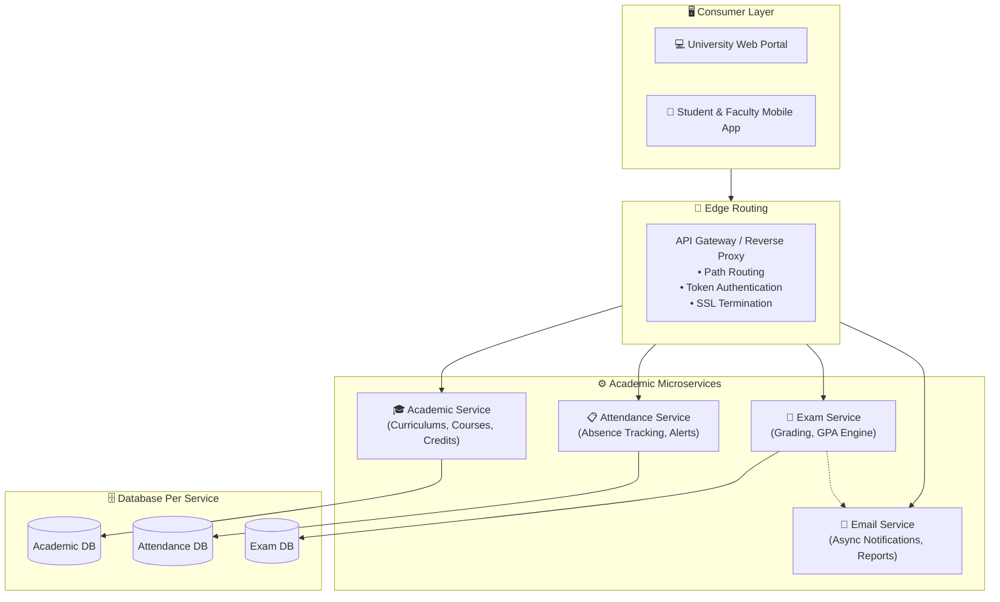

<div align="center">

# 🏛️ University Management System Microservice
### Enterprise Distributed Academic & Campus Governance Platform

[](https://dotnet.microsoft.com/)
[](https://learn.microsoft.com/en-us/dotnet/csharp/)
[](#-system-architecture)
[](https://www.docker.com/)
[](LICENSE)
[](https://github.com/OmarAlfar0uk)

<p align="center">
  <a href="#-key-features">Key Features</a> •
  <a href="#-system-architecture">System Architecture</a> •
  <a href="#-microservices-catalog">Microservices Catalog</a> •
  <a href="#-tech-stack">Tech Stack</a> •
  <a href="#-getting-started">Getting Started</a> •
  <a href="#-author">Author</a>
</p>

</div>

---

## 📌 Executive Overview

**University Management System Microservice** is a production-grade, distributed campus management solution built to streamline higher education workflows. Decoupled into specialized microservices, the system handles student admissions, academic curricula, faculty assignments, attendance monitoring, examination grading, and automated notification services with high availability.

> [!NOTE]
> Designed using **Domain-Driven Design (DDD)**, **Clean Architecture**, and an **API Gateway pattern**, ensuring independent service deployability, database-per-service isolation, and robust cross-service communication.

---

## ✨ Key Features

| ⚡ Feature | 💡 Description | 🛠 Engineering Detail |
|---|---|---|
| **🚪 API Gateway Entrypoint** | Centralized reverse proxy for client requests | Single endpoint routing, header normalization, and rate limiting |
| **🎓 Academic & Curriculum Svc** | Course catalogs, credit hour validation, and prerequisites | Domain validation logic ensuring prerequisites before enrollment |
| **📋 Attendance Tracking** | Real-time lecture attendance logging and absence triggers | High-throughput tracking with automated warnings |
| **📝 Examination & Grading** | Exam scheduling, question banks, and automated GPA calculation | Concurrency-safe grading engine with audit history |
| **📬 Distributed Notification Svc** | Asynchronous transactional email dispatch | Decoupled notification pipeline with background queueing |
| **🔐 Role-Based Access Control** | Distinct capabilities for Students, Professors, and University Admins | Stateless JWT token validation across gateway and services |

---

## 🏛 System Architecture



---

## 📦 Microservices Catalog

| Service | Responsibility | Port | Primary Endpoints |
|---|---|---|---|
| **API Gateway** | Request dispatching, reverse proxy, routing | `:5000` | `/api/gateway/*` |
| **AcademicService** | Degrees, courses, semester catalogs, departments | `:5001` | `/api/academic/courses`, `/api/academic/departments` |
| **AttendanceService** | Class attendance, student absence ratios | `:5002` | `/api/attendance/record`, `/api/attendance/summary` |
| **ExamService** | Exam configurations, student submissions, grades | `:5003` | `/api/exams/schedule`, `/api/exams/grades` |
| **EmailService** | Templated alerts, grade release emails | `:5004` | `/api/email/dispatch` |

---

## ⚡ Tech Stack

| Category | Technology | Purpose |
|---|---|---|
| **Core Framework** |   | Distributed microservices runtime |
| **Gateway & Routing** |  | Centralized routing and cross-cutting security |
| **Data & Persistence** |   | Database-per-service relational persistence |
| **Security** |  | Inter-service and client authentication |
| **Containers** |  | Containerized development and deployment |

---

## 🚀 Getting Started

### Prerequisites
- [.NET 8.0 SDK](https://dotnet.microsoft.com/download/dotnet/8.0)
- [Docker Desktop](https://www.docker.com/products/docker-desktop) or local SQL Server instance

### Setup & Execution

1. **Clone the repository:**
   ```bash
   git clone https://github.com/OmarAlfar0uk/UniversityManagementSystemMicroservice.git
   cd UniversityManagementSystemMicroservice
   ```

2. **Restore Dependencies & Build:**
   ```bash
   dotnet restore
   dotnet build
   ```

3. **Run Services Simultaneously:**
   You can launch the solution in Visual Studio with Multiple Startup Projects configured, or use the .NET CLI:
   ```bash
   dotnet run --project "API Gateway/API Gateway.csproj"
   dotnet run --project "AcademicService/AcademicService.csproj"
   dotnet run --project "AttendanceService/AttendanceService.csproj"
   dotnet run --project "ExamService/ExamService.csproj"
   dotnet run --project "EmailService/EmailService.csproj"
   ```

---

## 👨‍💻 Author

**Omar Alfarouk**  
*Full-Stack .NET & Software Engineer*  

- 🌐 **GitHub:** [@OmarAlfar0uk](https://github.com/OmarAlfar0uk)
- 💼 **LinkedIn:** [omar-alfarouk](https://www.linkedin.com/in/omar-alfarouk-252471251/)
- 📧 **Email:** [omaralfarouk646@gmail.com](mailto:omaralfarouk646@gmail.com)

---

<div align="center">
  <sub>Built with ❤️ by Omar Alfarouk. Licensed under the <a href="LICENSE">MIT License</a>.</sub>
</div>
